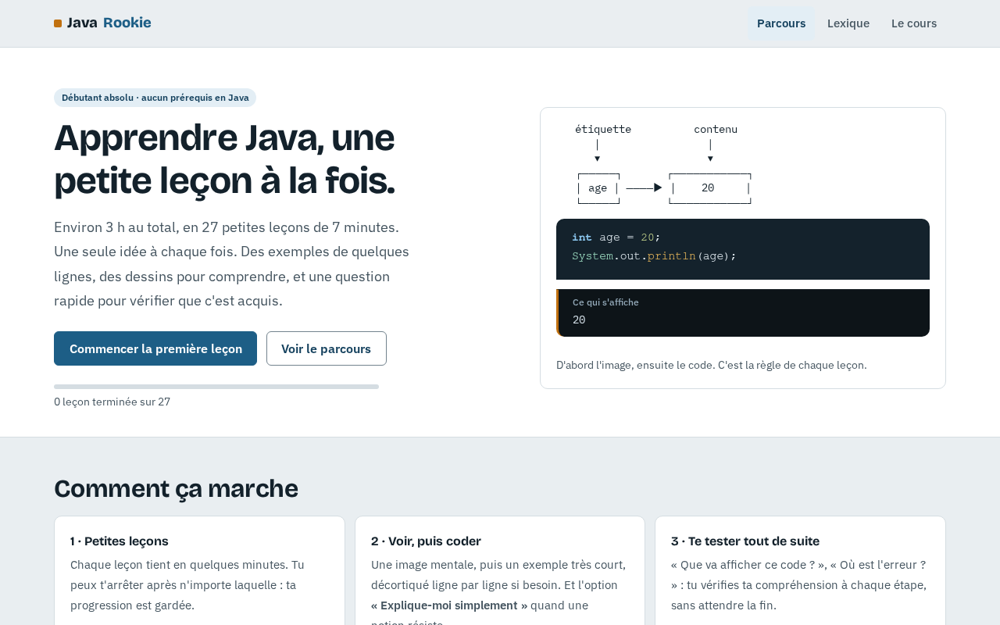
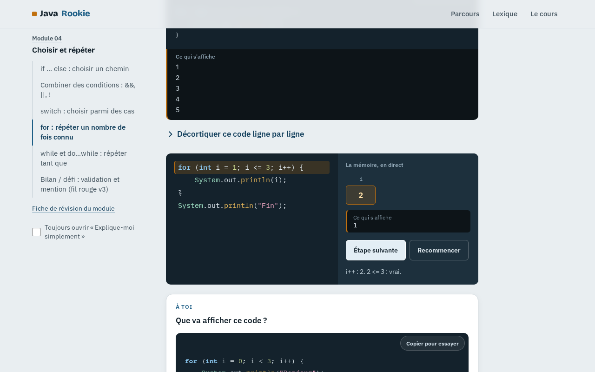
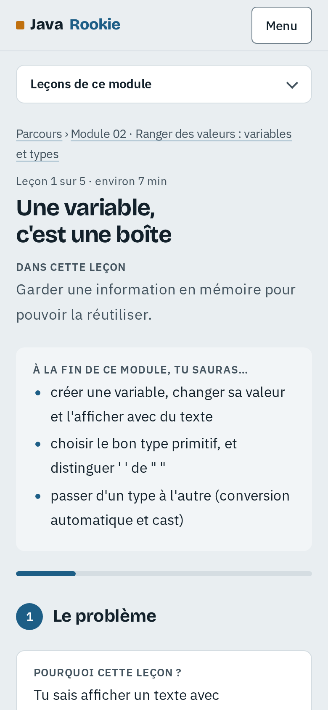

# Java Rookie

**Apprendre les bases de Java en partant de zéro, une petite leçon à la fois.**

Java Rookie est un site pédagogique gratuit et autonome pour les débutants absolus. On y apprend **les bases de Java en environ 3 h**, en **27 petites leçons d'environ 7 minutes**, sans professeur à côté et sans se fatiguer.

Il accompagne le cours « Programmation orientée-objet : Java » du Pr. Samba DIAW (Département Génie Informatique, ESP-UCAD, Dakar). Il prolonge aussi [Algo Rookie](https://github.com/thesombrecoder18/algo-rookie) : les idées de l'algorithmique restent les mêmes, seule la façon de les écrire change.



---

## Le principe

> **Court à lire. Facile à regarder. Simple à comprendre. Riche en exemples. Jamais épuisant.**

- **Une seule idée par leçon.** Les leçons s'arrêtent avant de devenir longues.
- **L'image d'abord, le code ensuite.** Une variable est une boîte, une condition un chemin à deux directions, une méthode une petite machine, une référence une télécommande.
- **Des exemples de quelques lignes**, souvent décortiqués ligne par ligne.
- **Des micro-victoires** : prédire ce qu'affiche un code, compléter un trou, remettre des lignes dans l'ordre, trouver l'erreur.
- **« Explique-moi simplement »** : une seconde explication, imagée, quand une notion résiste.
- **Simple dans la forme, rigoureux dans le fond.** Aucun terme technique n'est utilisé sans être expliqué. Les confusions classiques sont anticipées (`=` et `==`, `'a'` et `"a"`, classe et objet…).

| Une leçon | Sur téléphone |
|---|---|
|  |  |

## Le parcours

| Module | Thème | Leçons |
|---|---|---|
| 1 | **Premiers pas** : écrire, lancer et lire son premier programme | 3 |
| 2 | **Variables et types** : des boîtes étiquetées, conversions | 5 |
| 3 | **Calculer et dialoguer** : opérateurs, `++`, lire au clavier avec `Scanner` | 4 |
| 4 | **Choisir et répéter** : `if`, `&&`/`||`, `switch`, `for`, `while` | 6 |
| 5 | **Les méthodes** : créer, paramètres et `return`, surcharge | 3 |
| 6 | **Penser objet** : classes, objets, constructeur, encapsulation, héritage, et la suite | 6 |

Un fil rouge relie les modules : la fiche de l'étudiant Adama SECK devient, de version en version, une classe `Etudiant`.

Ce n'est **pas** un cours complet : les tableaux, les chaînes, les exceptions, les interfaces ou JDBC sont présentés comme « la suite » à la fin du parcours.

## Fonctionnalités

- **Leçons dévoilées étape par étape**, avec la position mémorisée : on reprend là où on s'était arrêté.
- **Exercices interactifs** : quiz avec nouvel essai, « que va afficher ce code ? », code à trous, lignes à remettre dans l'ordre, mini-exercices avec une zone d'essai.
- **Exécution pas à pas** : la mémoire est visible et les variables se remplissent ligne après ligne.
- **« Copier pour essayer »** : copie le programme complet, prêt à coller dans [OneCompiler](https://onecompiler.com/java) ou dans son éditeur.
- **Répétition espacée** : des questions « Rappel » sur les leçons précédentes, et une liste « À revoir ».
- **Fiche de révision** imprimable pour chaque module, et un **lexique** de 91 entrées (termes et messages d'erreur de `javac` traduits).
- **« Précision sur le support du cours »** : quand une slide contient une imprécision, la leçon la signale avec respect.
- **Responsive et accessible** : pensé pour le téléphone, navigable au clavier, contrastes WCAG AA.

La progression est enregistrée dans le navigateur (localStorage). Aucun compte, aucune donnée envoyée.

## Utilisation

Aucune installation : le site est entièrement statique.

```bash
git clone https://github.com/thesombrecoder18/java-rookie.git
cd java-rookie
# puis ouvrir index.html dans un navigateur
```

Ou avec un petit serveur local :

```bash
python3 -m http.server 8000   # puis http://localhost:8000
```

Le site peut aussi être publié tel quel avec GitHub Pages (Settings → Pages → branche `main`, dossier racine).

## Structure du projet

```
index.html  lecon.html  lexique.html  module.html     les pages
assets/styles.css                                      le design system
assets/js/noyau.js        utilitaires, progression, coloration Java, programme complet
assets/js/blocs.js        rendu des blocs (code, illustrations, encadrés, trace…)
assets/js/exercices.js    quiz, prédire, trous, ordre, mini-exercices
assets/js/pages.js        page leçon, parcours, lexique, fiche de module
courses/manifest.js       le parcours (généré depuis la carte pédagogique)
courses/<module>/<leçon>.js   le contenu des leçons (données uniquement)
courses/lexique.js        le lexique
docs/                     principes, carte pédagogique, format des leçons, revues qualité
tools/                    vérificateur, générateur de manifeste, mesure, tests navigateur
```

**Le contenu et l'affichage sont séparés.** Une leçon n'est qu'un objet de données (`JR.lecon({...})`), composé de blocs typés : `texte`, `illus`, `code`, `simple`, `erreur`, `quiz`, `predire`, `trous`, `ordre`, `trace`… Le contrat complet est dans [`docs/format-lecon.md`](docs/format-lecon.md), et [`docs/exemple/lecon-modele.js`](docs/exemple/lecon-modele.js) sert de leçon de référence.

## Qualité : tout est vérifié automatiquement

Prérequis : **JDK 21 ou plus récent** et **Node.js**. Une seule fois, pour les tests navigateur : `npm install`.

```bash
npm run verifier            # tout le contenu
node tools/verifier.mjs m03 --erreurs
node tools/mesure.mjs       # charge de chaque leçon (contrôle anti-fatigue)
npm run e2e                 # tests navigateur (Playwright)
```

- **`verifier`** compile **chaque extrait Java** avec `javac --release 21`, puis :
  - il exécute les programmes et compare chaque sortie annoncée à la sortie réelle, y compris avec saisie au clavier ;
  - il s'assure que les codes présentés comme « refusés » échouent vraiment ;
  - il contrôle les règles anti-fatigue : 2 questions de test, 3 points « À retenir » au maximum, aucun renvoi vers une leçon future…
- **`mesure`** compte, pour chaque leçon, les mots lus, les interactions, les questions et les erreurs, et les compare aux cibles : environ 300 mots, 3 interactions au maximum, un test de 2 questions.
- **`e2e`** :
  - joue chaque type d'interaction dans un vrai navigateur, sur une leçon de test figée ;
  - vérifie la progression, la fiche de module et le lexique ;
  - contrôle que **les 27 leçons** ne débordent pas sur un écran de téléphone de 375 px.

Le contenu a aussi été relu par des agents spécialisés : une revue Java, un audit pédagogique et de fatigue cognitive, et deux passages d'une « débutante simulée ». Les rapports sont dans [`docs/`](docs/).

## Contribuer au contenu

1. Lire [`docs/principes.md`](docs/principes.md), [`docs/format-lecon.md`](docs/format-lecon.md) et la leçon modèle.
2. Modifier ou ajouter une leçon dans `courses/`.
3. Si le parcours change (ajout, coupe, renommage) : mettre à jour [`docs/carte-pedagogique.md`](docs/carte-pedagogique.md), puis lancer `npm run manifeste`.
4. Lancer `npm run verifier` (0 problème attendu), `node tools/mesure.mjs` et `npm run e2e`.

Les sessions [Claude Code](https://claude.com/claude-code) qui reprennent le projet lisent [`CLAUDE.md`](CLAUDE.md) et [`docs/ETAT.md`](docs/ETAT.md). Le skill de projet `.claude/skills/lecon-java-rookie/` décrit la méthode pour écrire ou corriger une leçon.

## Licence

Usage pédagogique et personnel. Le contenu du cours officiel cité reste la propriété de son auteur.
